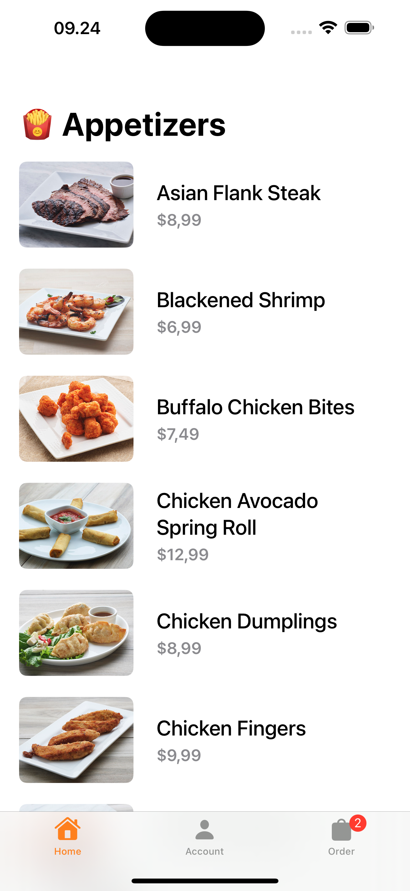
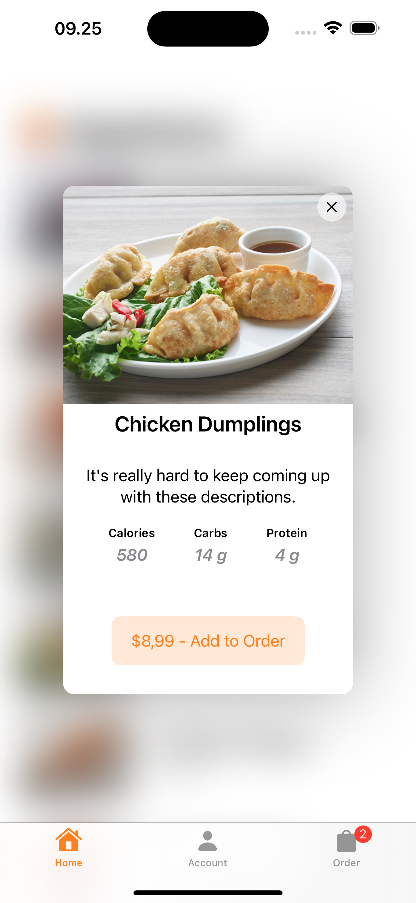
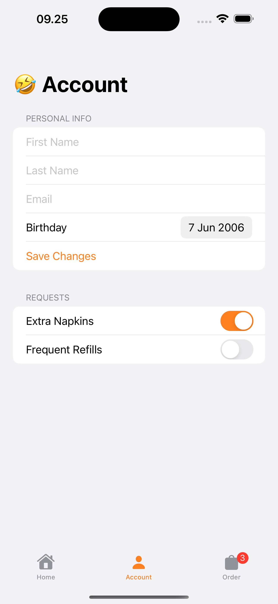
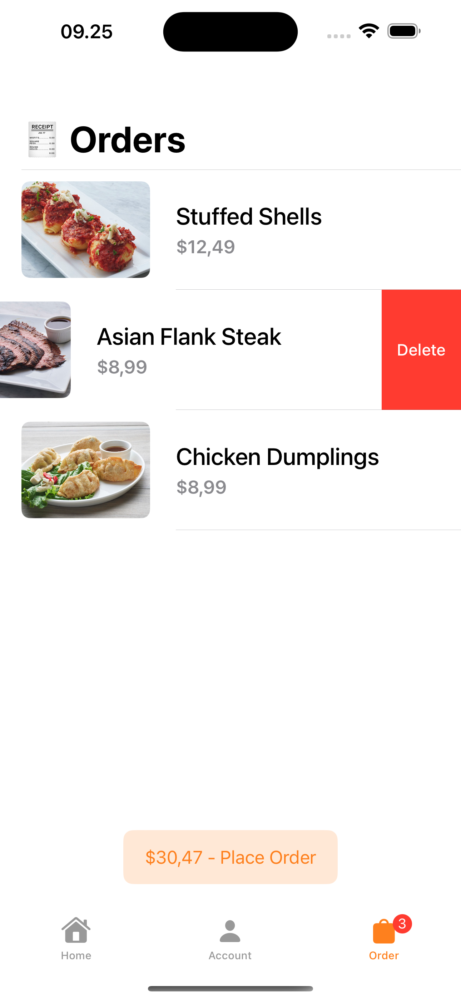

# Appetizer (Online Order Application) - SwiftUI

    
    
    
    

## Introduction

The Appetizer App is an online order application designed to provide users with a seamless experience for browsing appetizer lists, placing orders, viewing order details, and managing their account.

## Features

1. Food Lists: Users can browse through a list of available food items.
2. Orders: Users can place orders for their desired food items.
3. Order Details: Users can view details of their orders.
4. Account Management: Users can manage their account settings.
5. List ScrollView: Utilizes ScrollView to enable smooth scrolling through food lists.
6. Detail Overlay: Displays detailed information about food items in an overlay format.
7. AppStorage: Utilizes AppStorage to store data locally, providing offline access to certain features.
8. AsyncImage: Uses AsyncImage to fetch images from URLs, enhancing the visual appeal of food items.
9. @FocusState and .onSubmit: Implements @FocusState and .onSubmit to optimize user experience when interacting with the keypad, ensuring smooth input handling.
10. Using @Observable to Track Model: Implements @Observable to track changes in the data model, enhancing data management and enabling seamless updates to the UI based on model changes.

## Installation

To install the Appetizer App, follow these steps:

1. Clone the repository from GitHub.
2. Open the project in Xcode.
3. Build and run the project on your desired device or simulator.

 

💙 If you like this project, give it a ⭐ and share it with friends!

  
  
  

